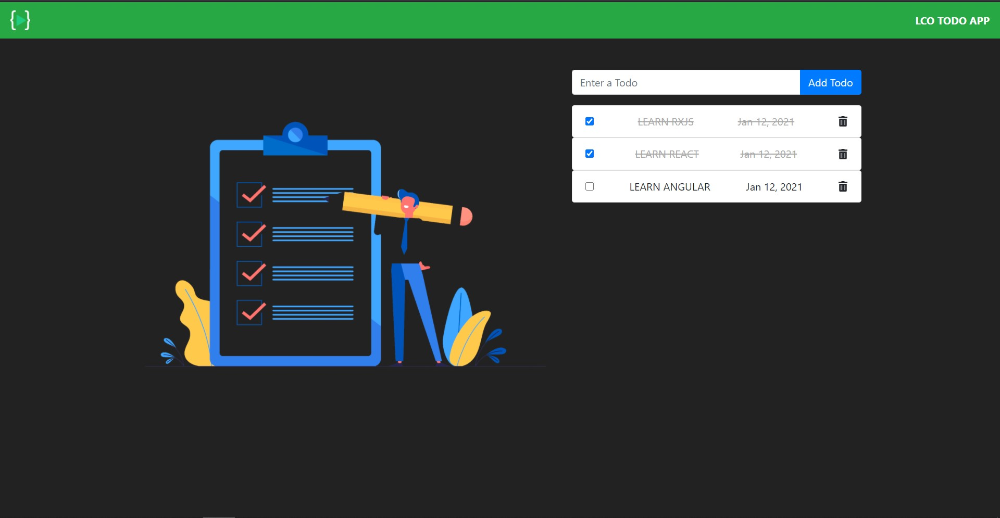

# TodoApp

This project is a simple Todo App with check, uncheck and delete options.

## App Images

- Initial App
  

- After Adding Todo
  

## Topics Learned

- **Creating app structure:** What are the things we need for our project
- **Creating project folders:** Creating Folders, installing the necessary dependencies.
- **Creating a model:** We create a Model for our App which consists of what are the items/properties need in our project. we are doing this because it will save a lot of time and it is pretty much useful.
- **Creating services and using them:** We Generate services, through which any change made in the App is get effected. By using services and deriving what it should do, it will get easier to implement some things in our components.
- **Recative form:** Angular has basically two types of forms **Reactive Forms** and **Template-driven Forms**. we are using _Reactive Forms_ here. For detailed info about them visit [Forms](https://angular.io/guide/forms-overview).
- **Two-way binding:** Two-way binding gives components in your application a way to share data. Use two-way binding to listen for events and update values simultaneously between parent and child components. For detail info visit [Two-way Binding](https://angular.io/guide/two-way-binding)
- **Angular pipe:** Use pipes to transform strings, currency amounts, dates, and other data for display. For detail info visit [Pipes](https://angular.io/guide/pipes)

## Development server

Run `ng serve` for a dev server. Navigate to `http://localhost:4200/`. The app will automatically reload if you change any of the source files.

## Note:

- After cloning the App into you system, please install the dependencies using npm.

```nodejs
npm install
```

- Run the above command in your terminal, it will install all the necessary dependecy files for you.
